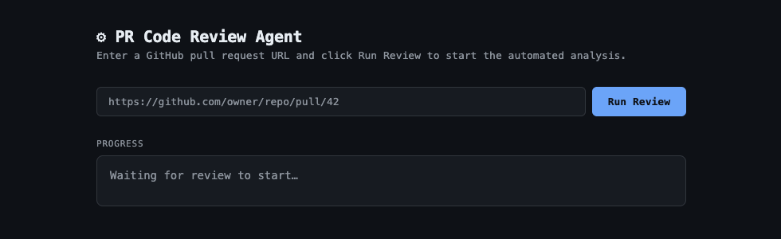

# Code Review Memory

An AI code-review service that reviews GitHub pull requests and remembers your
team's coding-style preferences across reviews. It streams review feedback over
SSE and stores style "memory" so future reviews stay consistent with your
conventions.

Style rules are parsed from `coding_style.md` and review memory is persisted to
`review_memory_store.json` — no database is required to run the app.

[](https://render.com/deploy?repo=https://github.com/calvinlee326/code-review-memory)

## Live demo



- **Review UI:** https://code-review-memory.onrender.com/api/
- **Health check:** https://code-review-memory.onrender.com/api/healthz

> Hosted on Render's free tier — the instance sleeps after inactivity, so the
> first request may take ~50s to wake. All routes are served under `/api`.

## How it works (the review harness)

The core of this project is the **review harness** — an orchestrated LLM
pipeline that turns a PR URL into posted review comments. It runs as a single
streaming pass (`run_harness` in `artifacts/api-server/src/lib/harness.ts`) and
emits a progress event at every step so the UI can render it live over SSE.

```
PR URL
  │
  ▼
┌─────────────────────────────────────────────────────────────┐
│ 1. Load memory      coding_style.md → style rules            │
│                     review_memory_store.json → past errors   │
│ 2. Read PR diff     GitHub API → changed files + patches     │
│ 3. Plan             per-file LLM pass → candidate issues     │
│ 4. Evaluate         second LLM audit → keep/modify/delete/add│
│ 5. Execute          post surviving comments → record memory  │
└─────────────────────────────────────────────────────────────┘
  │
  ▼
Comments on the PR + updated memory
```

Step by step:

1. **Load memory.** Parse `coding_style.md` into structured style rules and load
   previously recorded review errors from `review_memory_store.json`. Emits
   `memory_loaded`.
2. **Read the PR diff.** Fetch the changed files and their patches from the
   GitHub API, keeping only files that have a reviewable diff. Emits
   `files_fetched`.
3. **Planning phase.** For each patched file, the model reviews the diff against
   the style rules and returns a strict JSON array of candidate issues
   (`file`, `line`, `issue`, `severity`). Emits `file_reviewed` per file, then
   `plan_complete`.
4. **Evaluation phase.** A second "senior reviewer" pass audits the whole plan
   and labels each item `keep`, `modify` (with a rewritten comment), or
   `delete` (false positive), and may `add` clearly-missed high-severity
   violations. This self-critique gate is what keeps the output high-signal.
   Emits `evaluation_complete`.
5. **Execution phase.** Every non-deleted item is posted as an inline review
   comment on the PR, and each is written back into the memory store as a
   recorded error. Emits `comment_posted` per comment, then `done`.

### Example run

Hitting the stream endpoint returns a live SSE feed — one `data:` line per
`HarnessEvent` as the harness works through the pipeline:

```console
$ curl -N "https://code-review-memory.onrender.com/api/review/stream?pr_url=https://github.com/owner/repo/pull/42"

data: {"type":"memory_loaded","highlightsLoaded":18,"errorsLoaded":5}
data: {"type":"files_fetched","total":7,"patchable":4}
data: {"type":"file_reviewed","filename":"src/auth/login.ts","issueCount":2}
data: {"type":"file_reviewed","filename":"src/auth/session.ts","issueCount":1}
data: {"type":"file_reviewed","filename":"src/utils/format.ts","issueCount":0}
data: {"type":"file_reviewed","filename":"src/api/users.ts","issueCount":3}
data: {"type":"plan_complete","issues":[ ... 6 candidate issues ... ]}
data: {"type":"evaluation_complete","kept":3,"modified":1,"deleted":2,"added":1}
data: {"type":"comment_posted","file":"src/auth/login.ts","line":24,"action":"keep","url":"https://github.com/owner/repo/pull/42#discussion_r..."}
data: {"type":"comment_posted","file":"src/api/users.ts","line":58,"action":"modify","url":"https://github.com/owner/repo/pull/42#discussion_r..."}
data: {"type":"done","totalPosted":5}
```

Note how the **evaluation** pass dropped 2 false positives and added 1
missed high-severity issue before anything was posted — the planning pass found
6 candidates, but only 5 high-signal comments reached the PR.

Why it's structured this way (harness-engineering notes):

- **Separation of plan and execution** — generate candidate issues first, then
  audit them, so a cheap critique pass removes false positives before anything
  is posted.
- **Streaming observability** — every phase emits a typed `HarnessEvent`, making
  the pipeline debuggable and the UI live without extra plumbing.
- **Strict JSON contracts** — each LLM call is constrained to a JSON schema and
  defensively parsed, so a malformed response degrades to an empty result
  instead of crashing the run.
- **Persistent memory** — style rules and recorded errors live in plain files,
  so the harness has no database dependency and its memory is inspectable and
  diffable in git.

## Stack

- **Runtime:** Node.js 24, TypeScript 5.9, pnpm workspaces
- **API:** Express 5 (`artifacts/api-server`)
- **Storage:** JSON file (`review_memory_store.json`)
- **Validation:** Zod (`zod/v4`)
- **API codegen:** Orval (from an OpenAPI spec)
- **Build:** esbuild

> A Drizzle/PostgreSQL package exists in `lib/db` as scaffolding, but it is not
> imported by the running server.

## Getting started

### Prerequisites

- Node.js 22.9+ (uses `--env-file-if-exists`)
- [pnpm](https://pnpm.io/installation)

Runs on macOS, Linux, and Windows — the correct native binaries are installed
automatically for your platform.

### Setup

```bash
pnpm install
cp .env.example .env   # then fill in the values
```

Environment variables (see `.env.example`):

| Variable         | Purpose                                | Required |
| ---------------- | -------------------------------------- | -------- |
| `OPENAI_API_KEY` | Used by the review harness             | yes      |
| `GITHUB_TOKEN`   | Repo read access to fetch PR diffs     | yes      |
| `PORT`           | Server port                            | yes (5000 in `.env.example`) |

`.env` is loaded automatically at startup — no need to export variables.

### Run

```bash
pnpm dev            # start the API server (loads .env, defaults to port 5000)
pnpm typecheck      # typecheck all packages
pnpm build          # typecheck + build all packages
```

Once running:

- `GET /api/healthz` — health check (`{"status":"ok"}`)
- `GET /api/` — review web UI
- `GET /api/review/stream?pr_url=<github-pr-url>` — stream a review over SSE

> **macOS note:** port 5000 is used by the AirPlay Receiver (Control Center).
> Set `PORT` to something else (e.g. `5050`) in your `.env`, or disable AirPlay
> Receiver in System Settings → General → AirDrop & Handoff.

## Deploy

The repo includes a [`render.yaml`](./render.yaml) Blueprint for one-click
deploys on [Render](https://render.com):

1. **New +** → **Blueprint** → connect this repository.
2. Render reads `render.yaml` and creates the web service automatically.
3. Set `OPENAI_API_KEY` and `GITHUB_TOKEN` when prompted (stored in Render, not
   the repo). `PORT` is injected by Render; no database is needed.
4. Deploy. The service builds with esbuild and health-checks `/api/healthz`.

## License

[MIT](./LICENSE)
